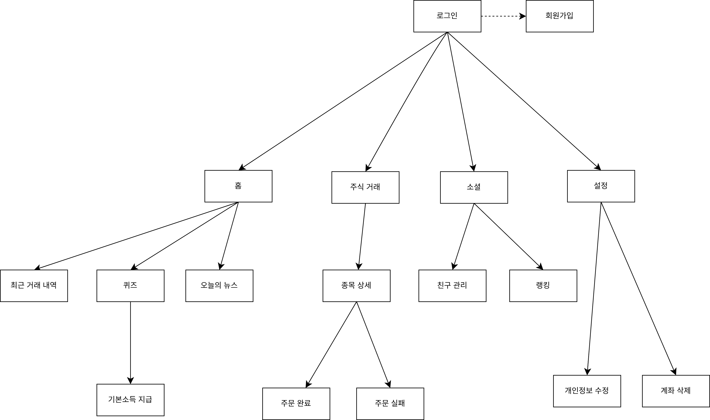

# 26s-w1-c3-06

## 공통과제 I : 웹 기반 프로젝트 (2인 1팀)

**목적:** 공통 과제를 함께 수행하며 웹 개발의 전체 흐름을 빠르게 익히고 협업에 적응하기

**결과물:** 기획부터 배포까지 완료된 웹 서비스와 관련 문서 일체

---

## 팀원

| 이름 | GitHub | 역할 |
| --- | --- | --- |
|서영빈| https://github.com/izayoieosd | Backend, DB |
|김혜리| https://github.com/ireyhye| Frontend, 데이터 수집, Wireframe |

---

## 기획안

> 프로젝트 주제, 목적, 핵심 기능, 예상 사용자, 팀원별 역할 등 정리

**주제:** 가상자산 주식 모의투자 웹서비스

**목적:** 과거 주가 데이터를 기반으로 가상의 투자 환경을 제공하는 청소년 및 초보자 대상 모의투자 웹 서비스. 실제 뉴스와 함께 투자를 경험하며 금융 지식을 학습할 수 있다.

**핵심 기능:** 가상계좌 생성, 실제 기업과 연동되는 주가 추종, 가상주식 매매, 수익률 확인

**예상 사용자:** 주식 투자에 관심이 있으나 법령상, 재정상의 문제로 실거래가 불가능하거나, 실습 위주의 경제 학습을 체험해보고자 하는 청소년 전용

---

## 기능 명세서

> 구현할 기능을 사용자 관점에서 정리하고, 필수 기능과 선택 기능을 구분

### 필수 기능

1. **가상계좌 관리**
  - 계정 회원가입 / 로그인 페이지
  - 계좌 현황 : 닉네임, 총자산, 총수익, 현금 보유량, 보유 종목 수, 최근 거래 내역
  - 계정에 시드 자산 지급 (계좌 생성 직후 100만원 지급)
  - 일일 퀴즈 정답 시 기본소득 지급 (하루 1회)
  - 개인정보 수정 (닉네임, 비밀번호)
  - 계정 삭제 (삭제 전 확인 절차 포함, 복구 불가 안내)

2. **가상주식 열람**
  - 기업별 주가 연동 (과거 데이터 기반, 가상 거래일 단위로 재생)
  - 기업명, 기업 로고, 한 줄 소개, 현재 주가, 등락률 목록화 및 표시
  - 기업 관련 실제 뉴스 제목 및 원문 링크 제공 (가상 거래일 기준으로 그 시점의 뉴스 노출)
  - 현재 주가, 고가/저가, 거래량, 종가 추이 그래프 표시
  - 내가 보유한 종목의 보유수량, 평균 매수가, 평가금액, 평가손익 표시

3. **가상주식 매매**
  - 가상주식 주문 (거래유형: 매수 / 매도, 현재가 기준 즉시 체결)
  - 수량 입력 (직접 입력 및 보유 현금·수량 기준 비율(10%/25%/50%/최대) 선택)
  - 주문 체결 완료 / 실패(잔고 부족, 보유수량 부족) 알림 메시지 전송
  - 최근 거래 내역 조회 (매수/매도 구분, 날짜, 수량, 금액)

4. **소셜**
  - 친구 추가 (아이디 검색) / 삭제
  - 친구 요청 수락 / 거절
  - 친구 목록 열람
  - 일간 수익률(순수 주식 매매 성과 기준, 기본소득 제외) 기반 친구 랭킹 및 전체 랭킹 집계 및 표시

### 선택 기능

---

## IA 및 화면 설계서

> 서비스의 전체 페이지 구조와 페이지 간 이동 흐름; 각 페이지의 주요 UI 구성, 입력 요소, 버튼, 사용자 행동 흐름 등을 간단한 와이어프레임 형태로 정리

### IA (정보 구조도)

<p align="center">
  
</p>

### 화면 설계 (Figma)
[Figma 화면 설계](https://www.figma.com/design/UA0CwwncocjZ67imzxZzoA/%EC%A0%9C%EB%AA%A9-%EC%97%86%EC%9D%8C?node-id=0-1&p=f&t=eJf0nP6BjuCCft16-0)

---

## DB 스키마

> 필요한 테이블, 주요 필드, 데이터 타입, 테이블 간 관계를 정리

<center>
  
</center>

---

## API 문서

> API 주소, 요청 방식, 요청값, 응답값, 에러 상황을 정리

| Method | Endpoint | 설명 | 요청 | 응답 |
|---|---|---|---|---|
| account.Create | /auth/signup | 계좌 및 계정 생성; 기본금 1,000,000원 지급 | POST | |
| account.Authenticate | /auth/login | 계좌 아이디 및 비밀번호 정보 일치 확인 | POST | |
| account.id_exists | /auth/check-id?id={id} | 계좌 아이디 및 비밀번호 정보 일치 확인 | GET | |
| account.nickname_exists | /auth/check-nickname?nickname={nickname} | 계좌 아이디 및 비밀번호 정보 일치 확인 | GET | |
| account.View | /account?id={id} | 계좌명, 보유 주식, 수익 금액 및 수익률, 계좌 잔고, 관련 뉴스 불러오기 | GET | |
| account.DailyBailout | /quiz?userId={userId} | 오늘의 퀴즈 풀기 | GET | |
| account.SubmitAndReward | /quiz/submit | 오늘의 퀴즈 채점 및 보상 받기 | POST | |
| account.Update | /settings | 계좌 정보 (프로필 사진, 닉네임, 비밀번호)를 변경 | PATCH | |
| account.Delete | /settings | 계정 삭제 | POST | | 
| account.StockList | /stock-list | 전체 주식 리스트 불러오기 | GET | |
| account.StockDetail | /stock-detail | 주식 정보 보기 | GET | |
| account.PlaceOrder | /order | 주식 주문하기 | POST | |
| account.TransactionHistory | /history?userId={userId} | 주식 주문 내역 보기 | GET | |
| account.StockNews | /stock/news?stock={stock} | 주식 관련 뉴스 열람 | GET | |
| account.SocialRanking | /social/ranking?userId={userId} | 주식 투자 수익 랭킹 보기 | GET | |
| account.RequestFriends | /social/request-friends | 친구 신청하기 | POST | |
| account.AcceptFriends | /social/accept-friends | 친구 신청 수락하기 | POST | |
| account.SocialView | /social | 친구 목록 열람 | GET | |
| account.DeleteFriends | /social/delete-friends | 친구 삭제 | POST | |
| account.ListNotificationsView | /notifications | 알림 목록 보기 | GET | |
| account.DeleteNotificationView | /notifications/delete | 알림 목록 보기 | POST | |

| stock_PriceUpToDate | | 가상주식 가격을 연동 (50ms 단위) | | | 
| stock_ShowList | | 가상주식 목록 - 기업명, 기업 로고, 현재 주가, 주가 변동분 표시 (보유 주식과 검색 결과로 나온 주식 모두 적용) | | |
| stock_ShowEntry | | 단일 주식의 그래프, 현재 주가 표시 | | | 
| order_Create | | 가상주식 주문 (매수 / 매도, 주문량 설정) | | |
| order_Edit | | 가상주식 주문 수정 (주문량 변경) | | |
| order_Destroy | | 가상주식 주문 취소 | | |
| order_Sign | | 주문 가격 도달시 가상주식 주문 체결 | | |
| ranking_Update | | 일간 주식 수익 랭킹 업데이트 | | |
| ranking_Show | | 일간 주식 수익 랭킹 표시 | | |
| notify_Stock | | 마지막 공지 시점으로부터 단일 주식의 주가 변화를 알림으로 공지함 | | |
| notify_Order | | 주문의 체결 성공 / 실패 / 취소를 알림으로 공지함 | | |
| notify_Friends | | 친구 요청 발신 / 수신, 친구 삭제를 알림으로 공지함 | | |
| quiz_Show | | 오늘의 퀴즈 보여주기 | | |
| quiz_Submit | | 퀴즈 정답 제출 | | |
| quiz_Check | | 퀴즈 정답 채점 | | |

---

## 배포 결과물

> 접속 가능한 링크, 실행 방법, 주요 구현 내용

- **서비스 URL:**
- **실행 방법:**

```bash
# 실행 방법 작성
```

---

## 회고 문서

> 개발 과정에서의 어려움, 해결 방법, 역할 분담, 다음에 개선할 점 (KPT 방법론 참고)

### Keep

### Problem

### Try

---

## 참고 자료

- [SDD(스펙 주도 개발) 이해하기](https://news.hada.io/topic?id=21338)
- [Software Design Document Best Practices](https://www.atlassian.com/work-management/project-management/design-document)
- [IA 정보구조도 작성 방법](https://brunch.co.kr/@nyonyo/7)
- [기획자 화면설계서 작성법](https://brunch.co.kr/@soup/10)
- [Figma 와이어프레임 가이드](https://www.figma.com/ko-kr/resource-library/what-is-wireframing/)
- [무료 Figma 와이어프레임 키트](https://www.figma.com/ko-kr/templates/wireframe-kits/)
- [ERD/DB 설계 총정리](https://inpa.tistory.com/entry/DB-%F0%9F%93%9A-%EB%8D%B0%EC%9D%B4%ED%84%B0-%EB%AA%A8%EB%8D%B8%EB%A7%81-%EA%B0%9C%EB%85%90-ERD-%EB%8B%A4%EC%9D%B4%EC%96%B4%EA%B7%B8%EB%9E%A8)
- [API 명세서 작성 가이드라인](https://velog.io/@sebinChu/BackEnd-API-%EB%AA%85%EC%84%B8%EC%84%9C-%EC%9E%91%EC%84%B1-%EA%B0%80%EC%9D%B4%EB%93%9C-%EB%9D%BC%EC%9D%B8)
- [좋은 README 작성하는 방법](https://velog.io/@sabo/good-readme)
- [단기 프로젝트 회고 KPT 방법론](https://velog.io/@habwa/%EB%8B%A8%EA%B8%B0-%ED%94%84%EB%A1%9C%EC%A0%9D%ED%8A%B8-%ED%9A%8C%EA%B3%A0-KPT-%EB%B0%A9%EB%B2%95%EB%A1%A0)
